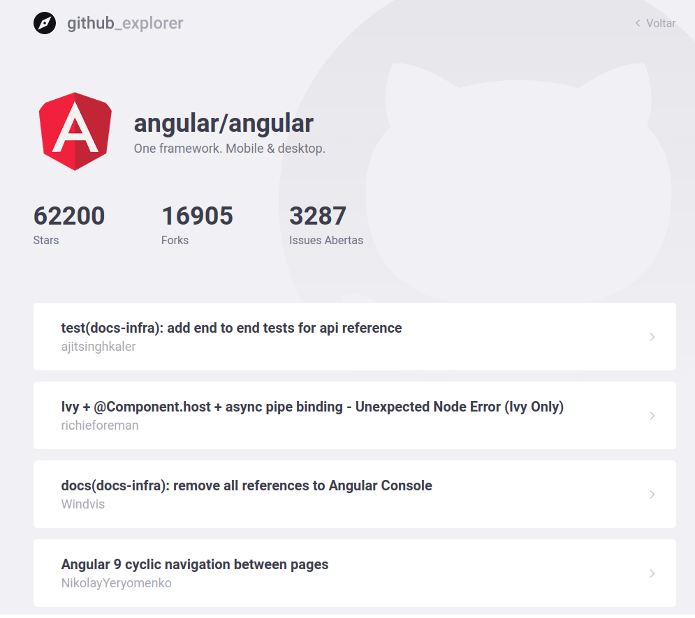

# GitHub Explorer

Aplicação desenvolvida com ReactJs usando Typescript durante o Bootcamp da Rocketseat.

É uma simples pagina que você pode cadastrar os repositorios do Github, e ver suas informações postarirmente!

Foi usado Styles-Components para sua estilização

Foi validado erros nas entradas do Input!

Imagens da aplicação:

DashBoard:

Issues:

### Desenvolvido por [Fernando Santos](https://www.linkedin.com/in/fernando-santos-686632122/)
